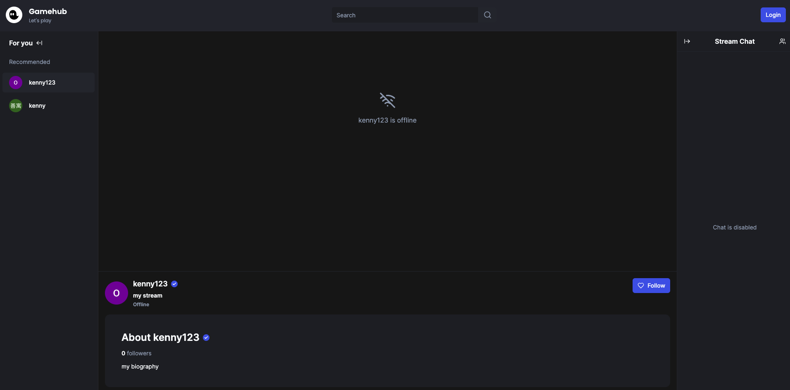

# Twitch Clone Practice

## [Demo Website](https://twitch-clone-practice.vercel.app/)

這是一個使用 [Next14](https://nextjs.org/) 構建的 Twitch Clone 練習專案。

## 技術特點

專案：

- Developing with Next.js 14, design communication between ServerComponent and ClientComponent.

- Next.js 14 Server Action function runs on the server.

- Utilize Svix for handling Webhooks-related functionalities.

- Leverage various useful hooks provided by the usehooks-ts library.

- Using Ngrok for testing during development

- Utilize tanstack/react-table and shadcn-ui to handle tables concurrently.

UI：

- Utilize Shadcn-ui for handling the appearance and UI aspects.

- Utilize various icons provided by lucide-react.

- Utilize clsx for optimizing the Tailwind layout.

- Sonner handles the display of success and failure toasts.

State management：

- Implementing state management using Zustand.

Database：

- Utilize PlanetScale service to establish a MySQL database.

- Utilize the Prisma ORM to communicate with the database.

User：

- Utilize Clerk services to manage user account functionalities.

Live streaming：

- Utilize Livekit services to handle live streaming and chat room functionalities.

 

## 功能特點

Account system:

- Offers Google login for members and visitors

- Channel recommendations
- Blacklist and following channels

Live streaming features:

- Implements Twitch-specific live streaming functions, such as real-time chat, watching live broadcasts, etc.
